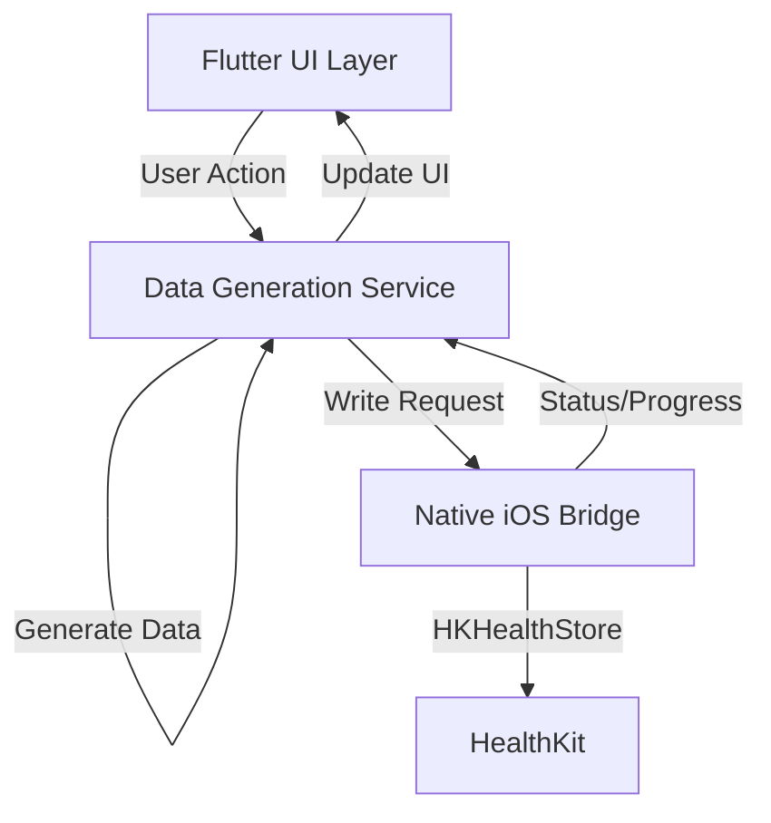

# Design Document: HealthKit Data Generator

## Overview

The HealthKit Data Generator is a standalone Flutter iOS application that generates one year of synthetic health data mimicking Apple Watch patterns. The application uses a three-screen UI flow (Generation → Progress → Results) and writes data directly to HealthKit using native iOS bridges. The design emphasizes realistic data patterns with proper statistical distributions, temporal variations, and long-term trends to enable comprehensive testing of ATMO Shield's stress detection algorithms.

## Architecture

### High-Level Architecture



### Component Layers

1. **Presentation Layer (Flutter)**
   - Three screens: GenerationScreen, ProgressScreen, ResultsScreen
   - State management for generation progress
   - User input handling (button taps, toggles)

2. **Business Logic Layer (Dart)**
   - DataGenerationService: Orchestrates data generation
   - MetricGenerator classes: Generate specific health metrics
   - Statistical utilities: Gaussian distribution, trend calculation

3. **Platform Integration Layer (Method Channel)**
   - HealthKitBridge: Dart interface to native code
   - Platform-specific implementations for iOS

4. **Native Layer (Swift)**
   - HealthKitWriter: Batch write operations to HealthKit
   - Permission management
   - Error handling and logging

## Components and Interfaces

### 1. Flutter UI Components

#### GenerationScreen
```dart
class GenerationScreen extends StatefulWidget {
  // Main screen with generation button and optional feature toggles
  
  State:
  - bool includeSteps
  - bool includeSleep
  
  Methods:
  - onGeneratePressed() -> Navigate to ProgressScreen
  - toggleSteps(bool value)
  - toggleSleep(bool value)
}
```

#### ProgressScreen
```dart
class ProgressScreen extends StatefulWidget {
  // Progress display during generation
  
  State:
  - double progress (0.0 to 1.0)
  - String currentTask
  
  Methods:
  - updateProgress(double value)
  - onGenerationComplete() -> Navigate to ResultsScreen
}
```

#### ResultsScreen
```dart
class ResultsScreen extends StatelessWidget {
  // Display generation results
  
  Properties:
  - Map<String, int> recordCounts
  
  Methods:
  - openAppleHealth() -> Launch "x-apple-health://"
}
```

### 2. Data Generation Service

#### DataGenerationService
```dart
class DataGenerationService {
  // Orchestrates all data generation
  
  Properties:
  - DateTime startDate (today - 365 days)
  - DateTime endDate (today)
  - GenerationConfig config
  - ProgressCallback onProgress
  
  Methods:
  - Future<GenerationResult> generateAllData(GenerationConfig config)
  - Future<void> _generateHeartRate()
  - Future<void> _generateHRV()
  - Future<void> _generateRespiratoryRate()
  - Future<void> _generateSteps() // optional
  - Future<void> _generateSleep() // optional
}
```

#### GenerationConfig
```dart
class GenerationConfig {
  bool includeSteps
  bool includeSleep
  int targetHRRecords // 5000-10000
  double hrvTrendGrowth // 0.10-0.20 (10-20%)
  int trendDurationMonths // 3-6
}
```

#### GenerationResult
```dart
class GenerationResult {
  int hrRecordsGenerated
  int hrvRecordsGenerated
  int rrRecordsGenerated
  int stepsRecordsGenerated
  int sleepRecordsGenerated
  Duration generationTime
  List<String> errors
}
```

### 3. Metric Generators

#### HeartRateGenerator
```dart
class HeartRateGenerator {
  // Generates realistic HR data
  
  Methods:
  - List<HealthDataPoint> generate(DateTime start, DateTime end, int targetCount)
  - double _getBaselineHR(DateTime date) // Trend: gradual decrease
  - double _getHRForTimeOfDay(DateTime time) // Day/night variation
  - bool _isActiveTime(DateTime time) // Activity periods
}
```

#### HRVGenerator
```dart
class HRVGenerator {
  // Generates realistic HRV data with gaps
  
  Methods:
  - List<HealthDataPoint> generate(DateTime start, DateTime end)
  - int _getRecordsForDay(DateTime date) // 0-5 with probability distribution
  - double _getBaselineHRV(DateTime date) // Trend: gradual increase
  - bool _isStressDay(DateTime date) // 2-3 per month
  - List<DateTime> _getTimestampsForDay(DateTime date, int count)
}
```

#### RespiratoryRateGenerator
```dart
class RespiratoryRateGenerator {
  // Generates realistic RR data
  
  Methods:
  - List<HealthDataPoint> generate(DateTime start, DateTime end)
  - double _getBaselineRR(DateTime date) // Trend: gradual decrease
  - bool _isStressDay(DateTime date) // Correlate with HRV
  - DateTime _getNightTime(DateTime date) // Random night hour
}
```

### 4. Statistical Utilities

#### GaussianDistribution
```dart
class GaussianDistribution {
  // Box-Muller transform for normal distribution
  
  Methods:
  - double sample(double mean, double stdDev)
  - double clamp(double value, double min, double max)
}
```

#### TrendCalculator
```dart
class TrendCalculator {
  // Calculate trend values over time
  
  Methods:
  - double getValueWithTrend(
      double baseValue,
      DateTime currentDate,
      DateTime startDate,
      int trendDurationDays,
      double trendPercentage
    )
}
```

#### ProbabilityDistribution
```dart
class ProbabilityDistribution {
  // Weighted random selection
  
  Methods:
  - int sampleDiscrete(Map<int, double> probabilities)
  // Example: {0: 0.35, 1: 0.25, 2: 0.20, 3: 0.12, 4: 0.05, 5: 0.03}
}
```

### 5. Native iOS Bridge

#### HealthKitBridge (Dart)
```dart
class HealthKitBridge {
  static const MethodChannel _channel = MethodChannel('healthkit_generator');
  
  Methods:
  - Future<bool> requestPermissions(List<String> writeTypes)
  - Future<bool> writeHealthData(List<HealthDataPoint> data)
  - Future<bool> writeBatch(String dataType, List<Map<String, dynamic>> records)
}
```

#### HealthDataPoint
```dart
class HealthDataPoint {
  String type // 'heartRate', 'hrv', 'respiratoryRate', etc.
  double value
  DateTime timestamp
  String unit // 'bpm', 'ms', etc.
  
  Map<String, dynamic> toMap()
}
```

#### ATMOHealthKitWriter (Swift)
```swift
class ATMOHealthKitWriter: NSObject, FlutterPlugin {
    let healthStore = HKHealthStore()
    
    func requestPermissions(writeTypes: [String], completion: @escaping (Bool) -> Void)
    func writeBatch(dataType: String, records: [[String: Any]], completion: @escaping (Bool, Error?) -> Void)
    func createQuantitySample(type: HKQuantityType, value: Double, unit: HKUnit, date: Date) -> HKQuantitySample
    func batchWrite(samples: [HKSample], completion: @escaping (Bool, Error?) -> Void)
}
```

## Data Models

### HealthDataPoint Model
```dart
class HealthDataPoint {
  final String type
  final double value
  final DateTime timestamp
  final String unit
  
  // Validation
  bool isValid() {
    return value > 0 && 
           timestamp.isBefore(DateTime.now()) &&
           _isValidRange()
  }
  
  bool _isValidRange() {
    switch (type) {
      case 'heartRate':
        return value >= 40 && value <= 200
      case 'hrv':
        return value >= 10 && value <= 200
      case 'respiratoryRate':
        return value >= 8 && value <= 30
      default:
        return true
    }
  }
}
```

### Generation Statistics
```dart
class GenerationStatistics {
  // Track generation metrics
  int totalRecords
  int successfulWrites
  int failedWrites
  Duration totalTime
  Map<String, int> recordsByType
  
  void logSummary() {
    debugPrint('[SynthData] Generated $totalRecords records in ${totalTime.inSeconds}s')
    recordsByType.forEach((type, count) {
      debugPrint('[SynthData] $type: $count records')
    })
  }
}
```

## Correctness Properties

*A property is a characteristic or behavior that should hold true across all valid executions of a system—essentially, a formal statement about what the system should do. Properties serve as the bridge between human-readable specifications and machine-verifiable correctness guarantees.*

### Property 1: Date Range Consistency
*For any* data generation execution, all generated records should have timestamps that fall within exactly 365 consecutive days, with the start date being exactly 365 days before the current date.
**Validates: Requirements 1.1, 1.2, 7.6**

### Property 2: Required Data Types Presence
*For any* data generation execution with default configuration, the output should contain at least one record for each of the three required data types: Heart Rate, HRV, and Respiratory Rate.
**Validates: Requirements 1.3**

### Property 3: Optional Data Types Conditional Generation
*For any* data generation execution, if optional features (Steps or Sleep) are enabled in the configuration, then the output should contain records for those data types; if disabled, no records for those types should exist.
**Validates: Requirements 1.5**

### Property 4: Heart Rate Record Count Bounds
*For any* Heart Rate data generation, the total number of HR records should be between 5000 and 10000 inclusive.
**Validates: Requirements 2.1**

### Property 5: Heart Rate Timestamp Spacing
*For any* two consecutive Heart Rate records in chronological order, the time interval between them should be between 5 and 30 minutes.
**Validates: Requirements 2.2**

### Property 6: Heart Rate Value Ranges
*For any* Heart Rate record, the value should be between 60 and 120 bpm (covering both resting 60-80 and active 90-120 ranges).
**Validates: Requirements 2.3, 2.4**

### Property 7: Heart Rate Trend Direction
*For any* Heart Rate data generation, the average heart rate in the last 90 days should be lower than the average heart rate in the first 90 days, demonstrating cardiovascular improvement.
**Validates: Requirements 2.6**

### Property 8: HRV Daily Record Count Bounds
*For any* day in the generated HRV data, the number of HRV records for that day should be between 0 and 5 inclusive.
**Validates: Requirements 3.1**

### Property 9: HRV Total Record Count Bounds
*For any* HRV data generation across 365 days, the total number of HRV records should be between 600 and 900 inclusive.
**Validates: Requirements 3.3**

### Property 10: HRV Value Ranges
*For any* HRV record, the value should be between 10 and 200 milliseconds (covering stress <30, normal 40-60, and extended range).
**Validates: Requirements 3.4, 3.5**

### Property 11: HRV Trend Direction
*For any* HRV data generation with trend enabled, the average HRV in the last 90 days of the trend period should be 10-20% higher than the average HRV at the start of the trend period.
**Validates: Requirements 3.6**

### Property 12: HRV Gap Distribution
*For any* HRV data generation across 365 days, approximately 30-40% of days should have zero HRV records (allowing for statistical variation around the 35% target).
**Validates: Requirements 3.10, 6.7**

### Property 13: HRV Time Period Distribution
*For any* HRV data generation, records should be distributed across all four time periods (morning, day, evening, night), with each period containing at least 10% of total records.
**Validates: Requirements 3.7**

### Property 14: Respiratory Rate Exact Daily Count
*For any* Respiratory Rate data generation across 365 days, the total number of RR records should be exactly 365 (one per day).
**Validates: Requirements 4.1**

### Property 15: Respiratory Rate Value Ranges
*For any* Respiratory Rate record, the value should be between 12 and 22 breaths per minute (covering normal 12-16 and stressed 18-22 ranges).
**Validates: Requirements 4.2, 4.3**

### Property 16: Respiratory Rate Trend Direction
*For any* Respiratory Rate data generation, the average RR in the last 90 days should be lower than the average RR in the first 90 days, demonstrating respiratory improvement.
**Validates: Requirements 4.4**

### Property 17: Optional Steps Value Ranges
*For any* Steps data generation when enabled, all daily step count values should be between 5000 and 10000 steps inclusive.
**Validates: Requirements 5.1**

### Property 18: Optional Sleep Value Ranges
*For any* Sleep data generation when enabled, all daily sleep duration values should be between 7 and 8 hours (420-480 minutes).
**Validates: Requirements 5.2**

### Property 19: Weekend Sleep Increase
*For any* Sleep data generation when enabled, the average sleep duration on weekends (Saturday, Sunday) should be greater than the average sleep duration on weekdays (Monday-Friday).
**Validates: Requirements 5.3**

### Property 20: Multi-Metric Trend Consistency
*For any* data generation with all metrics enabled, the data should show consistent improvement trends: HRV increasing, RR decreasing, and HR decreasing over the trend period.
**Validates: Requirements 6.1**

### Property 21: Stress Event Frequency
*For any* data generation across 365 days, there should be between 24 and 36 stress days total (2-3 per month × 12 months).
**Validates: Requirements 6.4**

### Property 22: Stress Event Metric Correlation
*For any* identified stress day, the HRV value should be below 30ms AND the RR value should be above 18 breaths per minute, demonstrating correlated stress indicators.
**Validates: Requirements 6.6**

### Property 23: Gaussian Distribution Statistical Properties
*For any* metric data generation (HR, HRV, RR), when excluding trend effects, the residual values should approximate a normal distribution (verified using statistical tests like Shapiro-Wilk or Kolmogorov-Smirnov).
**Validates: Requirements 3.9, 4.6, 6.5**

### Property 24: HealthKit Data Format Consistency
*For any* quantitative metric (HR, HRV, RR, Steps), all generated data points should use the HKQuantitySample format with appropriate unit types.
**Validates: Requirements 7.2**

### Property 25: Generation Result Completeness
*For any* data generation execution, the GenerationResult should report counts for all enabled data types, and the sum of reported counts should equal the total number of records generated.
**Validates: Requirements 9.4**


## Error Handling

### Permission Errors

**Scenario**: User denies HealthKit write permissions

**Handling Strategy**:
1. Catch permission denial in `HealthKitBridge.requestPermissions()`
2. Display user-friendly error message: "HealthKit access is required to generate test data. Please enable permissions in Settings."
3. Provide button to open iOS Settings app using URL scheme: `App-Prefs:root=Privacy&path=HEALTH`
4. Log error with prefix `[SynthData] Permission denied for types: [list]`
5. Do NOT crash - return to Generation screen gracefully

**Implementation**:
```dart
try {
  final granted = await HealthKitBridge.requestPermissions(writeTypes);
  if (!granted) {
    _showPermissionError();
    return GenerationResult.permissionDenied();
  }
} catch (e) {
  debugPrint('[SynthData] Permission error: $e');
  _showPermissionError();
  return GenerationResult.error(e.toString());
}
```

### HealthKit Write Errors

**Scenario**: Individual record write fails (e.g., invalid data, HealthKit unavailable)

**Handling Strategy**:
1. Catch write errors in batch operations
2. Log specific error with record details: `[SynthData] Failed to write HR record at {timestamp}: {error}`
3. Continue with remaining records (fail gracefully, not catastrophically)
4. Track failed writes in `GenerationResult.failedWrites`
5. Display summary on Results screen: "Generated X records, Y failed"

**Implementation**:
```dart
Future<int> _writeBatch(List<HealthDataPoint> batch) async {
  int successCount = 0;
  for (final point in batch) {
    try {
      await HealthKitBridge.writeHealthData([point]);
      successCount++;
    } catch (e) {
      debugPrint('[SynthData] Failed to write ${point.type} at ${point.timestamp}: $e');
      _statistics.failedWrites++;
    }
  }
  return successCount;
}
```

### Data Generation Errors

**Scenario**: Exception during data generation (e.g., date calculation error, random number generation failure)

**Handling Strategy**:
1. Wrap generation methods in try-catch blocks
2. Log detailed error with stack trace: `[SynthData] Generation error in {method}: {error}\n{stackTrace}`
3. Return partial results if some data was generated successfully
4. Display error on Results screen with option to retry
5. Preserve app stability - never crash the UI

**Implementation**:
```dart
try {
  final hrData = await _generateHeartRate();
  result.hrRecordsGenerated = hrData.length;
} catch (e, stackTrace) {
  debugPrint('[SynthData] HR generation error: $e\n$stackTrace');
  result.errors.add('Heart Rate generation failed: $e');
  // Continue with other data types
}
```

### Platform Errors

**Scenario**: HealthKit not available (simulator, unsupported iOS version)

**Handling Strategy**:
1. Check `HKHealthStore.isHealthDataAvailable()` before any operations
2. Display clear error: "HealthKit is not available on this device. Please run on a physical iPhone with iOS 16+."
3. Disable generation button if HealthKit unavailable
4. Log platform info: `[SynthData] HealthKit unavailable: iOS {version}, Device: {model}`

**Implementation**:
```swift
// In Swift native code
guard HKHealthStore.isHealthDataAvailable() else {
    completion(false, NSError(domain: "HealthKit", code: -1, 
        userInfo: [NSLocalizedDescriptionKey: "HealthKit not available"]))
    return
}
```

### Timeout Handling

**Scenario**: Generation takes longer than expected (>10 seconds)

**Handling Strategy**:
1. Implement timeout monitoring in `DataGenerationService`
2. Display warning after 10 seconds: "Generation is taking longer than expected..."
3. Allow user to cancel operation
4. Log performance metrics: `[SynthData] Generation time: {duration}s (target: 10s)`
5. Complete operation even if slow (don't force-kill)

## Testing Strategy

### Dual Testing Approach

The HealthKit Data Generator requires both unit tests and property-based tests to ensure correctness:

- **Unit tests**: Verify specific examples, edge cases, UI behavior, and error conditions
- **Property tests**: Verify universal properties across randomized inputs and large datasets

Both testing approaches are complementary and necessary for comprehensive coverage. Unit tests catch concrete bugs in specific scenarios, while property tests verify general correctness across the entire input space.

### Property-Based Testing

**Framework**: Use `dart_check` (pub.dev/packages/dart_check) for property-based testing in Dart

**Configuration**:
- Minimum 100 iterations per property test (due to randomization in data generation)
- Each test must reference its design document property using comment tags
- Tag format: `// Feature: healthkit-data-generator, Property {number}: {property_text}`

**Property Test Examples**:

```dart
// Feature: healthkit-data-generator, Property 1: Date Range Consistency
test('all generated records fall within 365-day range', () {
  forAll(
    arbitrary.dateTime,
    (currentDate) {
      final service = DataGenerationService(currentDate: currentDate);
      final result = service.generateAllData(GenerationConfig.default());
      
      final startDate = currentDate.subtract(Duration(days: 365));
      final allRecords = [...result.hrRecords, ...result.hrvRecords, ...result.rrRecords];
      
      return allRecords.every((record) =>
        record.timestamp.isAfter(startDate) &&
        record.timestamp.isBefore(currentDate)
      );
    },
    maxTests: 100,
  );
});

// Feature: healthkit-data-generator, Property 4: Heart Rate Record Count Bounds
test('HR record count is between 5000 and 10000', () {
  forAll(
    arbitrary.integer(min: 5000, max: 10000),
    (targetCount) {
      final config = GenerationConfig(targetHRRecords: targetCount);
      final service = DataGenerationService();
      final result = service.generateAllData(config);
      
      return result.hrRecordsGenerated >= 5000 && 
             result.hrRecordsGenerated <= 10000;
    },
    maxTests: 100,
  );
});

// Feature: healthkit-data-generator, Property 12: HRV Gap Distribution
test('approximately 35% of days have zero HRV records', () {
  forAll(
    arbitrary.seed,
    (seed) {
      final service = DataGenerationService(randomSeed: seed);
      final result = service.generateAllData(GenerationConfig.default());
      
      final daysWithZeroRecords = _countDaysWithZeroRecords(result.hrvRecords);
      final percentage = daysWithZeroRecords / 365.0;
      
      // Allow 5% variance (30-40% range)
      return percentage >= 0.30 && percentage <= 0.40;
    },
    maxTests: 100,
  );
});
```

### Unit Testing

**Framework**: Use Flutter's built-in `test` package

**Focus Areas**:
1. **Specific Examples**: Test known inputs with expected outputs
2. **Edge Cases**: Test boundary conditions (day 0, day 365, midnight timestamps)
3. **Error Conditions**: Test permission denial, write failures, invalid configurations
4. **UI Behavior**: Test screen navigation, button states, progress updates
5. **Integration Points**: Test Method Channel communication with native code

**Unit Test Examples**:

```dart
group('HeartRateGenerator', () {
  test('generates resting HR in correct range', () {
    final generator = HeartRateGenerator();
    final restingTime = DateTime(2024, 1, 1, 2, 0); // 2 AM
    final value = generator.getHRForTimeOfDay(restingTime);
    
    expect(value, greaterThanOrEqualTo(60));
    expect(value, lessThanOrEqualTo(80));
  });
  
  test('generates active HR in correct range', () {
    final generator = HeartRateGenerator();
    final activeTime = DateTime(2024, 1, 1, 14, 0); // 2 PM
    final value = generator.getHRForTimeOfDay(activeTime);
    
    expect(value, greaterThanOrEqualTo(90));
    expect(value, lessThanOrEqualTo(120));
  });
});

group('Error Handling', () {
  test('handles permission denial gracefully', () async {
    final mockBridge = MockHealthKitBridge();
    when(mockBridge.requestPermissions(any)).thenReturn(Future.value(false));
    
    final service = DataGenerationService(bridge: mockBridge);
    final result = await service.generateAllData(GenerationConfig.default());
    
    expect(result.status, GenerationStatus.permissionDenied);
    expect(result.errors, isNotEmpty);
  });
  
  test('continues generation after individual write failure', () async {
    final mockBridge = MockHealthKitBridge();
    var callCount = 0;
    when(mockBridge.writeHealthData(any)).thenAnswer((_) {
      callCount++;
      if (callCount == 1) throw Exception('Write failed');
      return Future.value(true);
    });
    
    final service = DataGenerationService(bridge: mockBridge);
    final result = await service.generateAllData(GenerationConfig.default());
    
    expect(result.failedWrites, equals(1));
    expect(result.hrRecordsGenerated, greaterThan(0));
  });
});

group('UI Navigation', () {
  testWidgets('tapping generate button navigates to progress screen', (tester) async {
    await tester.pumpWidget(MaterialApp(home: GenerationScreen()));
    
    final button = find.text('Generate 1 Year Data');
    expect(button, findsOneWidget);
    
    await tester.tap(button);
    await tester.pumpAndSettle();
    
    expect(find.byType(ProgressScreen), findsOneWidget);
  });
});
```

### Integration Testing

**Focus**: Test end-to-end flow with real HealthKit (on physical device)

**Test Scenarios**:
1. Generate data and verify it appears in Apple Health app
2. Test ATMO Shield can read the generated data
3. Verify data persistence across app restarts
4. Test with different permission states

**Integration Test Example**:

```dart
void main() {
  IntegrationTestWidgetsFlutterBinding.ensureInitialized();
  
  testWidgets('end-to-end data generation and verification', (tester) async {
    await tester.pumpWidget(HealthKitGeneratorApp());
    
    // Grant permissions (manual step)
    await tester.tap(find.text('Generate 1 Year Data'));
    await tester.pumpAndSettle();
    
    // Wait for generation to complete
    await tester.pump(Duration(seconds: 15));
    
    // Verify results screen
    expect(find.byType(ResultsScreen), findsOneWidget);
    expect(find.textContaining('Generated HR records:'), findsOneWidget);
    
    // Verify data in HealthKit
    final bridge = HealthKitBridge();
    final hrData = await bridge.readHealthData('heartRate', 
      startDate: DateTime.now().subtract(Duration(days: 365)),
      endDate: DateTime.now()
    );
    
    expect(hrData.length, greaterThanOrEqualTo(5000));
  });
}
```

### Test Coverage Goals

- **Unit Test Coverage**: >80% of Dart code
- **Property Test Coverage**: All 25 correctness properties implemented
- **Integration Test Coverage**: All critical user flows (generation, error handling, results display)
- **Manual Test Coverage**: UI/UX, Apple Health integration, ATMO Shield compatibility

### Testing Execution

```bash
# Run unit tests
flutter test

# Run property tests (subset of unit tests)
flutter test test/properties/

# Run integration tests (requires physical device)
flutter test integration_test/

# Run with coverage
flutter test --coverage
genhtml coverage/lcov.info -o coverage/html
```

### Continuous Testing

- Run unit tests on every commit (CI/CD)
- Run property tests nightly (longer execution time)
- Run integration tests before releases (manual, requires device)
- Monitor test execution time (target: <30 seconds for unit tests)

## Implementation Notes

### Performance Optimization

1. **Batch HealthKit Writes**: Group records into batches of 100-500 to reduce overhead
2. **Parallel Generation**: Generate different data types concurrently using `Future.wait()`
3. **Lazy Evaluation**: Generate timestamps first, then values on-demand
4. **Memory Management**: Stream large datasets instead of loading all in memory

### Random Number Generation

Use Dart's `Random` class with optional seed for reproducibility:

```dart
class DataGenerationService {
  final Random _random;
  
  DataGenerationService({int? seed}) 
    : _random = Random(seed ?? DateTime.now().millisecondsSinceEpoch);
  
  double _gaussian(double mean, double stdDev) {
    // Box-Muller transform
    final u1 = _random.nextDouble();
    final u2 = _random.nextDouble();
    final z0 = sqrt(-2.0 * log(u1)) * cos(2.0 * pi * u2);
    return mean + stdDev * z0;
  }
}
```

### Trend Implementation

Implement trends using linear interpolation with noise:

```dart
double _getValueWithTrend(DateTime date, double baseValue, double trendPercentage) {
  final daysSinceStart = date.difference(_startDate).inDays;
  final trendProgress = min(1.0, daysSinceStart / _trendDurationDays);
  final trendValue = baseValue * (1.0 + trendPercentage * trendProgress);
  
  // Add Gaussian noise (±10% variation)
  final noise = _gaussian(0, trendValue * 0.1);
  return max(0, trendValue + noise);
}
```

### Stress Day Correlation

Ensure stress days affect multiple metrics consistently:

```dart
class StressCalendar {
  final Set<DateTime> _stressDays;
  
  StressCalendar(DateTime start, DateTime end) {
    _stressDays = _generateStressDays(start, end);
  }
  
  Set<DateTime> _generateStressDays(DateTime start, DateTime end) {
    final days = <DateTime>{};
    final months = end.difference(start).inDays ~/ 30;
    
    for (int month = 0; month < months; month++) {
      // 2-3 stress days per month
      final stressCount = 2 + _random.nextInt(2);
      for (int i = 0; i < stressCount; i++) {
        final day = start.add(Duration(days: month * 30 + _random.nextInt(30)));
        days.add(DateTime(day.year, day.month, day.day));
      }
    }
    return days;
  }
  
  bool isStressDay(DateTime date) {
    final normalized = DateTime(date.year, date.month, date.day);
    return _stressDays.contains(normalized);
  }
}
```

### Native iOS Implementation

```swift
class ATMOHealthKitWriter: NSObject, FlutterPlugin {
    static func register(with registrar: FlutterPluginRegistrar) {
        let channel = FlutterMethodChannel(name: "healthkit_generator", 
                                          binaryMessenger: registrar.messenger())
        let instance = ATMOHealthKitWriter()
        registrar.addMethodCallDelegate(instance, channel: channel)
    }
    
    func handle(_ call: FlutterMethodCall, result: @escaping FlutterResult) {
        switch call.method {
        case "requestPermissions":
            requestPermissions(call: call, result: result)
        case "writeBatch":
            writeBatch(call: call, result: result)
        default:
            result(FlutterMethodNotImplemented)
        }
    }
    
    private func writeBatch(call: FlutterMethodCall, result: @escaping FlutterResult) {
        guard let args = call.arguments as? [String: Any],
              let dataType = args["dataType"] as? String,
              let records = args["records"] as? [[String: Any]] else {
            result(FlutterError(code: "INVALID_ARGS", message: nil, details: nil))
            return
        }
        
        let samples = records.compactMap { createSample(dataType: dataType, record: $0) }
        
        healthStore.save(samples) { success, error in
            if let error = error {
                print("[SynthData] Write error: \(error.localizedDescription)")
                result(FlutterError(code: "WRITE_ERROR", 
                                   message: error.localizedDescription, 
                                   details: nil))
            } else {
                result(true)
            }
        }
    }
}
```

## Deployment Considerations

### Info.plist Configuration

Required HealthKit permissions and usage descriptions:

```xml
<key>NSHealthShareUsageDescription</key>
<string>This app needs to read health data to verify generated test data.</string>

<key>NSHealthUpdateUsageDescription</key>
<string>This app generates synthetic health data for testing ATMO Shield stress detection.</string>

<key>UIBackgroundModes</key>
<array>
    <string>processing</string>
</array>
```

### Build Configuration

```yaml
# pubspec.yaml
name: healthkit_data_generator
description: Synthetic HealthKit data generator for ATMO Shield testing
version: 1.0.0+1

environment:
  sdk: ">=3.0.0 <4.0.0"
  flutter: ">=3.0.0"

dependencies:
  flutter:
    sdk: flutter
  health: ^10.0.0  # HealthKit integration
  
dev_dependencies:
  flutter_test:
    sdk: flutter
  dart_check: ^0.5.0  # Property-based testing
  mockito: ^5.4.0     # Mocking for unit tests
  integration_test:
    sdk: flutter
```

### Distribution

- **Target Audience**: Internal testing only (not App Store distribution)
- **Installation**: TestFlight or direct device installation via Xcode
- **Documentation**: Include README with setup instructions and usage guide
- **Compatibility**: Test on iOS 16, 17, and 18 devices

## Future Enhancements

Potential improvements for future versions (not in MVP):

1. **Custom Scenarios**: Allow users to define specific stress patterns or health events
2. **Real-time Generation**: Generate data incrementally over time instead of all at once
3. **Data Export**: Export generated data to CSV or JSON for analysis
4. **Visualization**: Display charts of generated data before writing to HealthKit
5. **ATMO Integration**: Direct integration with ATMO Shield for automated testing
6. **Advanced Patterns**: Simulate illness, exercise events, medication effects
7. **Multi-year Generation**: Support generating 2-5 years of data
8. **Data Validation**: Pre-flight validation of generated data against HealthKit constraints
